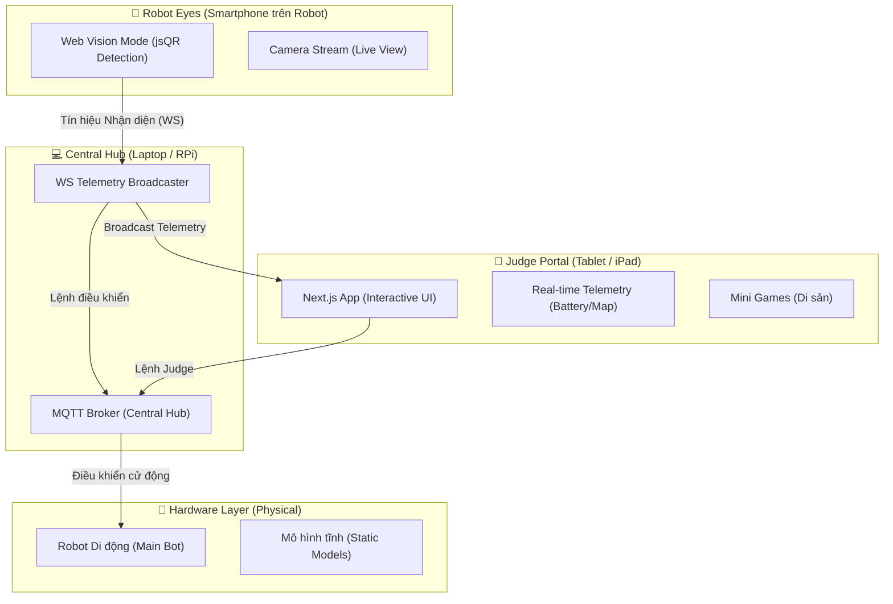

# 🏛️ Antigravyti: Kiến Trúc Hệ Thống Phân Tán (Distributed System)

Hệ thống **The Heritage Keeper** được thiết kế để hoạt động đa thiết bị, phối hợp nhịp nhàng giữa Robot, Điện thoại, Máy tính bảng và Hub trung tâm.

## 📐 Phân vai các thiết bị (Device Roles)

### 1. 📱 Robot Eyes (Smartphone gắn trên lưng Robot)
- **Nhiệm vụ:** Là "đôi mắt" của Robot.
- **Tính năng:** Chạy chế độ **Vision Mode**. Sử dụng engine `jsQR` để quét QR Codes Di sản. Khi thấy mã, nó gửi tín hiệu về Hub trung tâm qua WebSocket cực nhanh.

### 2. 📑 Judge Portal (Máy tính bảng cho Ban giám khảo)
- **Nhiệm vụ:** Giám sát hành trình và chấm điểm.
- **Tính năng:** 
    - Hiển thị **Live Map** với hệ thống trace đường đi thời gian thực.
    - Nhận dữ liệu Telemetry (Pin, vị trí) trực tiếp từ Hub.
    - Cung cấp giao diện Mini-games tương tác.

### 3. 💻 Central Hub (Laptop hoặc Raspberry Pi)
- **Nhiệm vụ:** Là "Hệ điều hành" trung tâm.
- **Tính năng:** 
    - Chạy **MQTT Broker** để tất cả các thiết bị "nói chuyện" với nhau.
    - Kết nối và kiểm soát đồng thời Robot di động và các trạm mô hình tĩnh trên sa bàn.
    - Chạy các model AI nặng (nếu trình duyệt không gánh nổi).

## 🚀 Lợi ích của mô hình này:
- **Tính độc lập:** Điện thoại chỉ tập trung "nhìn", Máy tính bảng chỉ tập trung "chơi". Không thiết bị nào bị quá tải.
- **Tính chuyên nghiệp:** Giám khảo có thể đứng xa sa bàn, cầm iPad để tương tác mà không làm ảnh hưởng đến hành trình của Robot.
- **Tính linh hoạt:** Có thể dễ dàng thêm nhiều Robot hoặc thiết bị IoT khác vào Hub trung tâm.
