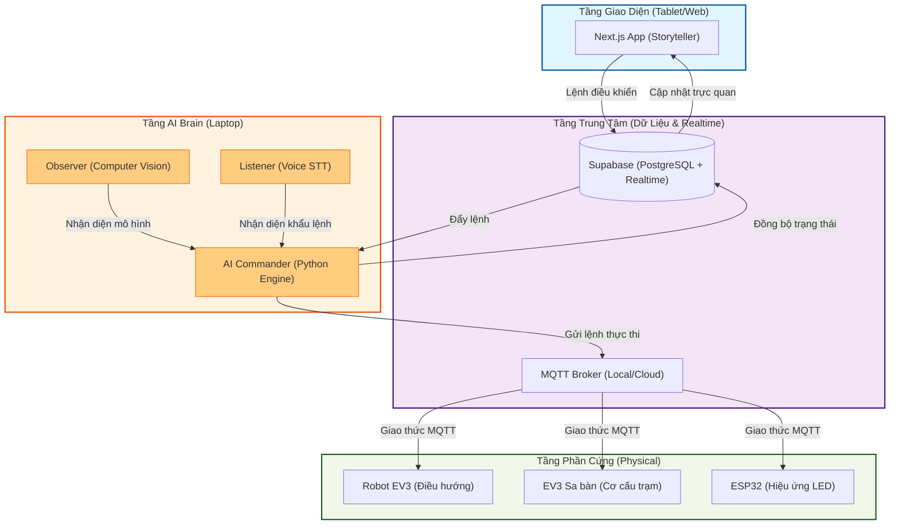

# 🏛️ Antigravyti: Cấu Trúc Tổng Quan Dự Án

Bản vẽ kiến trúc cấp cao thể hiện sự kết nối giữa các tầng công nghệ trong hệ sinh thái **The Heritage Keeper**.

## 📐 Giải thích các tầng (Layers Explanation)

1.  **UI Layer (Next.js):** Nơi hiển thị thông tin Di sản, bản đồ thực tế và giao diện để giám khảo tương tác (Quiz, Điều khiển thủ công).
2.  **Cloud Layer (Supabase/MQTT):** Xương sống dữ liệu. Supabase giữ các dữ liệu quan trọng như trạng thái và hàng đợi lệnh. MQTT truyền tải các lệnh phần cứng cực nhanh.
3.  **AI Brain Layer (Python):** Trung tâm xử lý. Nơi "nhìn" (Observer) và "nghe" (Listener) dữ liệu từ thế giới thực, sau đó ra quyết định (Commander).
4.  **Hardware Layer (EV3/ESP32):** Các robot và thiết bị vật lý thực hiện các cử động và hiệu ứng ánh sáng trên sa bàn.

Tất cả các thành phần này phối hợp để biến bảo tàng thành một không gian tương tác thông minh.
