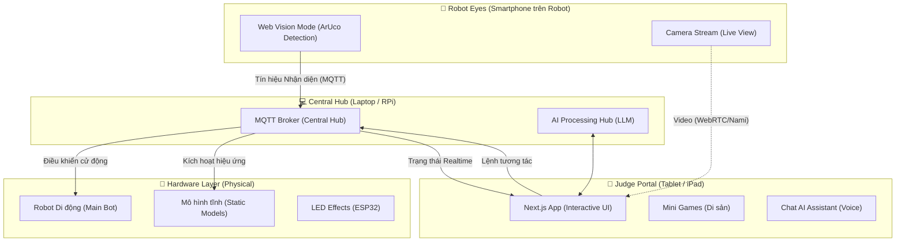

# 🏛️ Antigravyti: Kiến Trúc Hệ Thống Phân Tán (Distributed System)

Hệ thống **The Heritage Keeper** được thiết kế để hoạt động đa thiết bị, phối hợp nhịp nhàng giữa Robot, Điện thoại, Máy tính bảng và Hub trung tâm.

## 📐 Phân vai các thiết bị (Device Roles)

### 1. 📱 Robot Eyes (Smartphone gắn trên lưng Robot)
- **Nhiệm vụ:** Là "đôi mắt" của Robot.
- **Tính năng:** Chỉ chạy chế độ **Vision Mode**. Liên tục quét ArUco markers để tìm Di sản. Khi thấy mã, nó bắn trực tiếp lệnh điều khiển Robot qua MQTT. Ngoài ra, nó có thể stream video về máy tính bảng.

### 2. 📑 Judge Portal (Máy tính bảng cho Ban giám khảo)
- **Nhiệm vụ:** Là cửa ngõ trải nghiệm.
- **Tính năng:** 
    - Hiển thị video trực tiếp từ điện thoại Robot.
    - Chạy các **Mini-games** tương tác tại mỗi điểm dừng.
    - Tích hợp **AI Assistant** để trò chuyện và tra cứu thông tin di sản.

### 3. 💻 Central Hub (Laptop hoặc Raspberry Pi)
- **Nhiệm vụ:** Là "Hệ điều hành" trung tâm.
- **Tính năng:** 
    - Chạy **MQTT Broker** để tất cả các thiết bị "nói chuyện" với nhau.
    - Kết nối và kiểm soát đồng thời Robot di động và các trạm mô hình tĩnh trên sa bàn.
    - Chạy các model AI nặng (nếu trình duyệt không gánh nổi).

## 🚀 Lợi ích của mô hình này:
- **Tính độc lập:** Điện thoại chỉ tập trung "nhìn", Máy tính bảng chỉ tập trung "chơi". Không thiết bị nào bị quá tải.
- **Tính chuyên nghiệp:** Giám khảo có thể đứng xa sa bàn, cầm iPad để tương tác mà không làm ảnh hưởng đến hành trình của Robot.
- **Tính linh hoạt:** Có thể dễ dàng thêm nhiều Robot hoặc thiết bị IoT khác vào Hub trung tâm.
