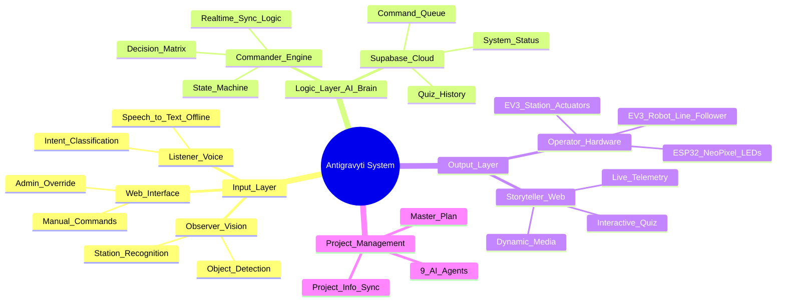

# 🧠 Antigravyti: System Flow Mindmap

Tài liệu này mô tả luồng hoạt động tổng thể của hệ thống Phygital, từ cảm biến đến hành động.

## 🚥 Luồng Dữ Liệu Chính (Data Pipeline)
1. **Sensors (Vision/Voice)** -> Phát hiện Sự kiện (Event).
2. **Commander** -> Xử lý Event & Cập nhật **Supabase**.
3. **Operator** -> Lắng nghe MQTT/Supabase & Điều khiển **Hardware**.
4. **Storyteller** -> Lắng nghe Supabase & Cập nhật **UI Tablet**.
