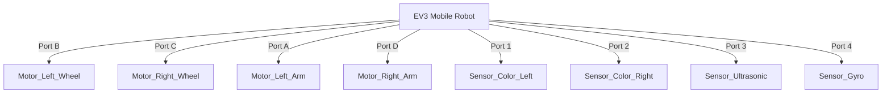
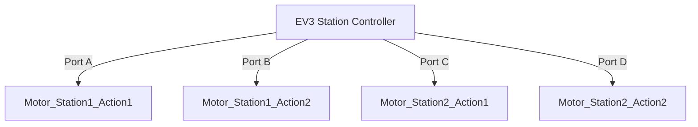

# 🤖 Hướng Dẫn Vận Hành Hệ Thống WRO 2026 (Custom Setup)

Tài liệu này được tùy chỉnh riêng cho kiến trúc phần cứng thực tế của bạn:
1.  **Mobile Robot (The Tour Guide):** 
    -   **Motors (4):** 2x Bánh xe (Drive - Port B, C), **2x Tay (Arms - Port A, D)** để diễn hoạt cử chỉ.
    -   **Sensors (4):** 2x Màu (Line Follow), 1x Siêu âm (Obstacle), 1x Gyro (Navigation).
    -   **Vision:** Điện thoại gắn cố định hướng về phía trước (Fixed Front-Facing).
    -   **Chiến thuật:** QR Code đặt tại các ngã tư (Waypoint). Robot đi theo line, đến ngã tư sẽ detect QR để biết mình đang ở đâu và rẽ hướng nào.
2.  **Station Controllers (The Stage Managers):** 
    -   2x EV3 (Bluetooth PAN).
    -   Mỗi EV3 điều khiển 2 trạm mô hình.
    -   Mỗi EV3 sử dụng full 4 động cơ: **Trạm 1 (Port A+B)**, **Trạm 2 (Port C+D)**.
3.  **Light Controller:** 1x ESP32 (WiFi) điều khiển 4 đèn LED RGB.

---

## 🗺️ Sơ Đồ Kết Nối & Port Map

### A. Mobile Robot Map (Guide Mode)

### B. Station Controller Map (Nhân x2)

---

## 🚀 Phần 1: Mobile Robot (EV3 WiFi)

Con này giữ nguyên như cũ, dùng USB WiFi để kết nối Router.

1.  **Kết nối:** Cắm USB WiFi -> Vào Wireless and Networks -> Wifi -> Connect to "WRO_WIFI".
2.  **Check IP:** Ghi lại IP (ví dụ: `192.168.1.101`).
3.  **Chạy Code:** SSH và chạy `main.py` (code điều khiển di chuyển đã có).
4.  **Lưu ý:** Cấu hình `config.json` của nó trỏ về IP của Mac (theo lớp mạng WiFi `192.168.1.x`).

---

## 🚀 Phần 2: Station Controller (EV3 - Dual Station)

Một con EV3 này sẽ đóng vai trò "Ông bầu", quản lý cả Trạm 1 và Trạm 2.

1.  **Kết nối:** Dùng **Bluetooth PAN** với Mac (như file hướng dẫn trước). 
    *   Lý do: Để tiết kiệm WiFi dongle và ổn định nếu WiFi quá tải.
    *   IP Mac Hub (Gateway): `192.168.2.1` (thường là vậy cho Bluetooth bridge).
    
2.  **Đấu nối Motor:**
    *   **Port A:** Motor cho Station 1 (ví dụ: Cổng thành/Rào chắn).
    *   **Port B:** Motor cho Station 2 (ví dụ: Guồng nước/Cờ).

3.  **Deploy Code (`dual_station_node.py`):**
    Chúng ta sẽ viết script mới xử lý 2 ID trạm cùng lúc.

---

## 🚀 Phần 3: Lighting Controller (ESP32)

ESP32 nhỏ gọn, dùng WiFi tích hợp sẵn.

1.  **Chuẩn bị:**
    *   Cài Arduino IDE hoặc PlatformIO.
    *   Thư viện: `PubSubClient` (MQTT), `Adafruit_NeoPixel` (nếu dùng LED Pixel) hoặc PWM thường.
    
2.  **Đấu nối LED RGB:**
    *   LED 1: Pin 12, 13, 14
    *   LED 2: Pin 25, 26, 27
    *   ... (Tùy chân ESP32)
    
3.  **Code ESP32:**
    *   Kết nối cùng WiFi với Mac.
    *   Broker IP: IP WiFi của Mac (`192.168.1.x`).
    *   Topic lắng nghe: `robot/lights/command`.

---

## 🛠️ Trình Tự Khởi Động (Startup Checklist)

1.  **Phase 1: Brain Up**
    -   Bật Mac.
    -   Kết nối WiFi "WRO_WIFI".
    -   Bật Bluetooth & Internet Sharing (cho Station).
    -   Chạy `npm start` (Web) & `python command_listener.py` (Brain).

2.  **Phase 2: Nodes Up**
    -   **Mobile:** Bật nguồn -> Đợi WiFi connect -> Chạy code.
    -   **Station:** Bật nguồn -> Connect Bluetooth PAN -> Chạy `dual_station_node.py`.
    -   **ESP32:** Cắm nguồn -> Đèn status nháy (báo đã connect WiFi & MQTT).

3.  **Phase 3: Verification**
    -   Mở Dashboard `localhost:3000/judge`.
    -   Nhìn vào bảng trạng thái: Tất cả các icon Mobile, Station 1, Station 2, Lights phải sáng xanh (Online).

---

## ⚠️ Khắc phục lỗi thường gặp

1.  **Station không nhận lệnh:** 
    -   Kiểm tra Bluetooth connection trên Mac (biểu tượng có connected không).
    -   Ping thử IP Station từ Mac: `ping 192.168.2.x`.
    
2.  **ESP32 không kết nối được Broker:**
    -   Tắt Firewall trên Mac (System Settings -> Network -> Firewall).
    -   Đảm bảo Mac và ESP32 cùng lớp mạng WiFi.

3.  **Đèn nháy loạn:**
    -   Kiểm tra nguồn cấp cho ESP32 (LED RGB ăn dòng lớn, nguồn USB laptop có thể không đủ nếu bật Full trắng 4 đèn).
